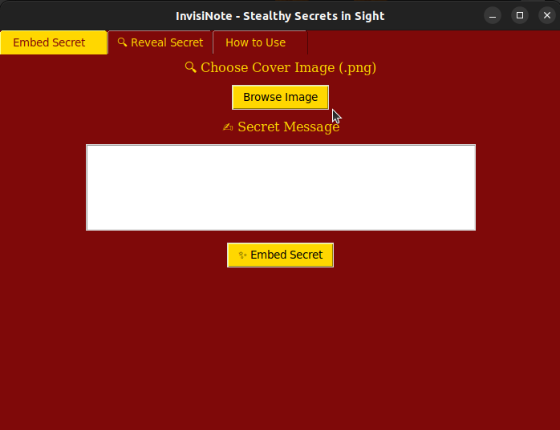
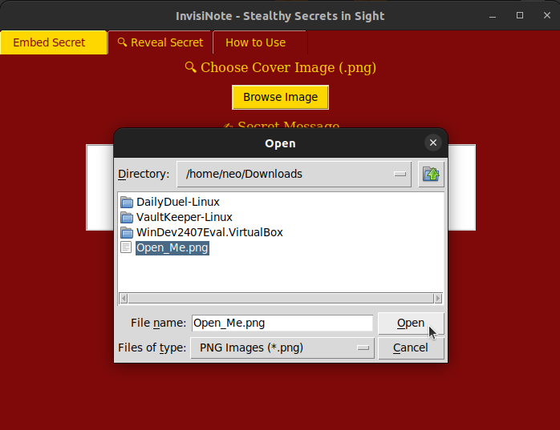
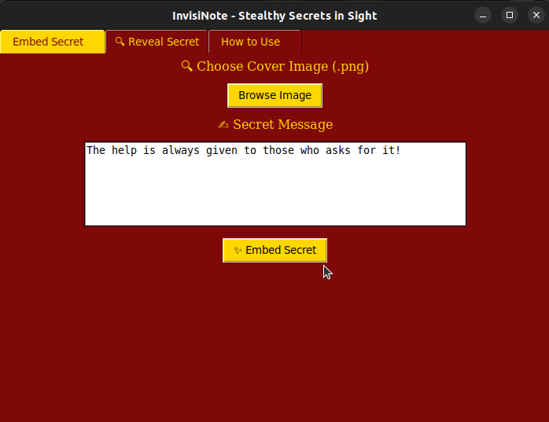
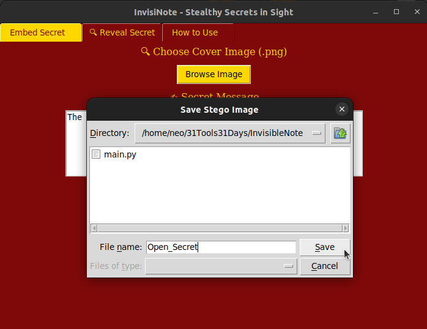
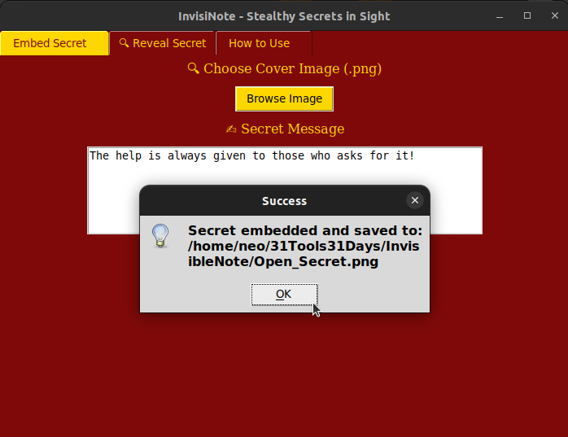
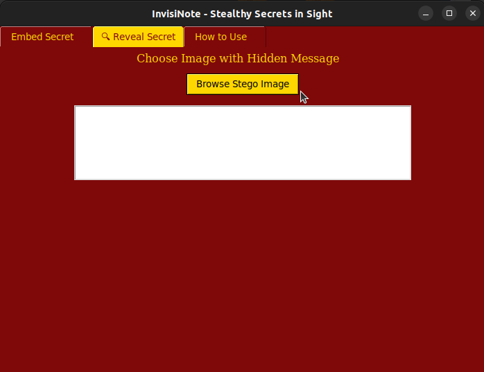
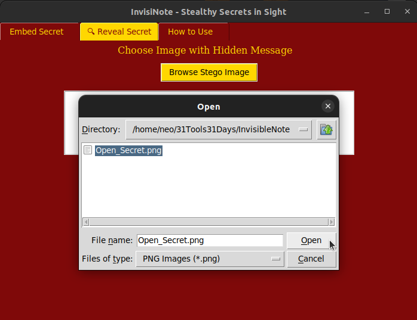
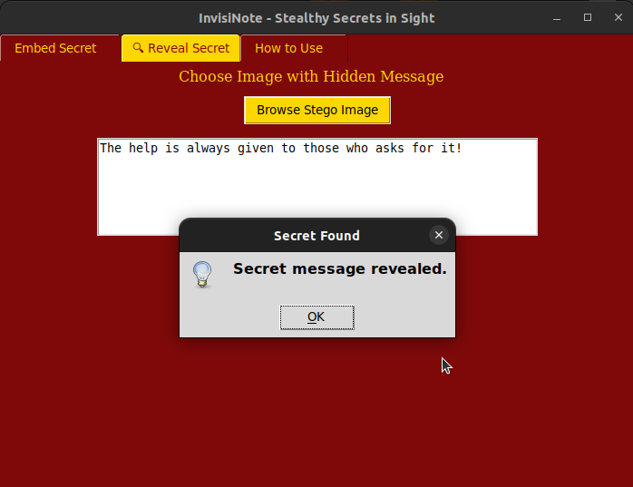
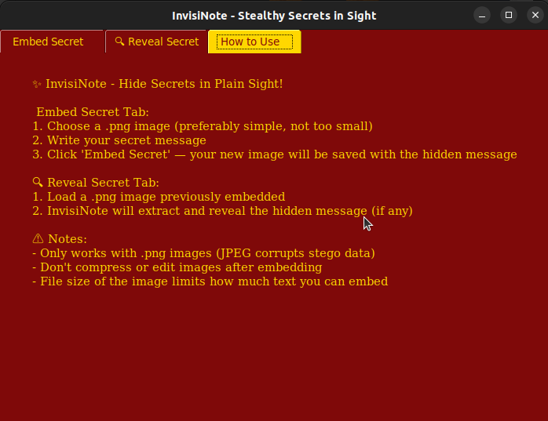

# 🪄 InvisiNote - Hide Secrets in Sight

InvisiNote lets you **hide secret messages inside innocent-looking `.png` images** using the magic of **Steganography** — think of it as a diary written with invisible ink 🕵️‍♂️✨

---

## 🔐 What Can It Do?

✔️ Hide secret messages inside any `.png` image  
✔️ Extract hidden messages from images  
✔️ Works completely offline — your secrets never leave your device  
✔️ Beautiful Gryffindor-themed UI with a 3-tab interface  
✔️ Made for cybersecurity enthusiasts, spies, and curious wizards 🧙‍♀️

---

## 🧰 Features

| Tab | Purpose |
|-----|---------|
| **📝 Embed Secret** | Choose a `.png`, write your message, and embed it |
| **🔍 Reveal Secret** | Load a previously modified `.png` to reveal the secret |
| **📘 How to Use** | Detailed instructions & warnings to avoid common pitfalls |

---

## ⚠️ Limitations & Cautions

- Only works with `.png` files (lossless format)
- Avoid re-saving or editing stego images after embedding — it can destroy the hidden message
- Ideal for **text only** secrets, not binary files or large payloads

---

## 🧙 Requirements

```bash
pip install -r requirements.txt
```

## Screenshots

> 

> 

> 

> 

> 

> 

> 

> 

> 


